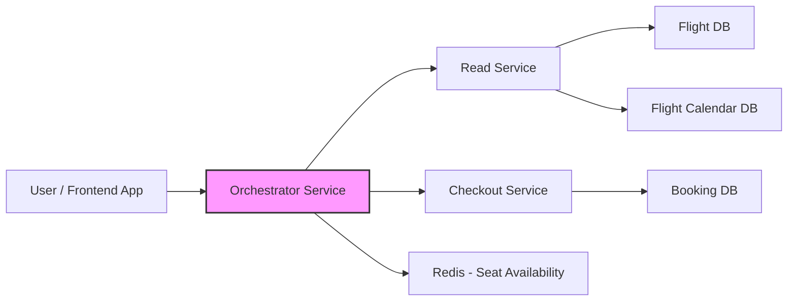
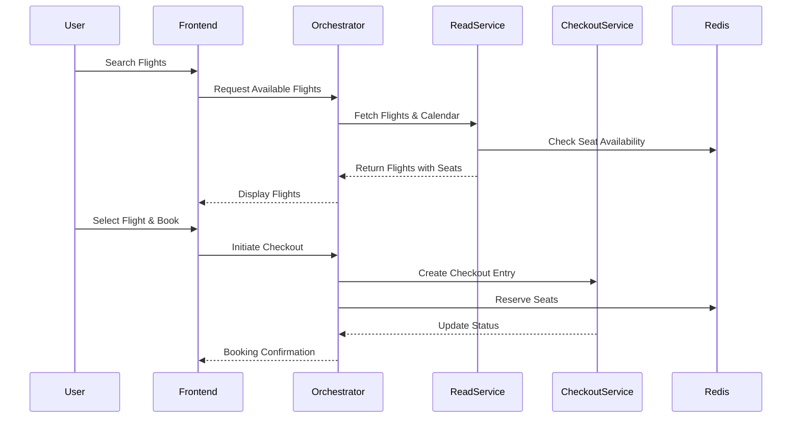
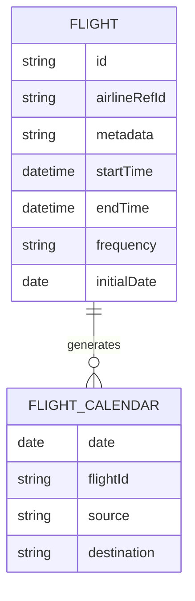
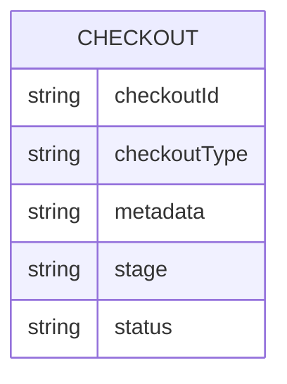

# Flight Ticketing System Design Document

## Table of Contents
1. [Overview](#overview)  
2. [Requirements](#requirements)  
   1. [Functional Requirements](#functional-requirements)  
   2. [Non-Functional Requirements](#non-functional-requirements)  
3. [High-Level Design (HLD)](#high-level-design-hld)  
   * [Architecture Diagram](#architecture-diagram)  
   * [Components & Responsibilities](#components--responsibilities)  
   * [High-Level Flow / Sequence](#high-level-flow--sequence)  
   * [Data Flow / Database Overview](#data-flow--database-overview)  
   * [Tech Stack](#tech-stack)  
   * [High-Level Interfaces](#high-level-interfaces)  
   * [Scalability / Security Considerations](#scalability--security-considerations)  
4. [Low-Level Design (LLD)](#low-level-design-lld)  
   * [Module / Class Design](#module--class-design)  
   * [APIs / Interfaces](#apis--interfaces)  
   * [Data Structures & DB Design](#data-structures--db-design)  
   * [Algorithms / Business Logic](#algorithms--business-logic)  
   * [Sequence / Interaction Diagrams (Detailed)](#sequence--interaction-diagrams-detailed)  
   * [Error Handling & Security Implementation](#error-handling--security-implementation)  
5. [Assumptions & Constraints](#assumptions--constraints)  
6. [Conclusion / Summary](#conclusion--summary)  

## Overview
The Flight Ticketing System allows users to search for available flights, check seat availability, and book tickets. The system supports direct and connecting flights, uses a preprocessed flight calendar, and maintains seat availability using an in-memory cache (Redis). A configurable state machine manages the booking workflow.

## Requirements

### Functional Requirements
* Display available flights to users.  
* Allow booking of flights, including connecting flights with layovers.  
* Manage seat availability dynamically with Redis for real-time updates.  
* Maintain a preprocessed calendar for flights for efficient lookup.  
* Support configurable state machines for booking workflows.  
* Provide a checkout service that tracks booking stages and status.  
* Support multi-modal expansion in the future (railway, buses, etc.).  

### Non-Functional Requirements
* **Latency:** Search and seat availability queries should respond <200ms.  
* **Throughput:** Support 10k+ concurrent bookings.  
* **Scalability:** Horizontal scaling for read service, orchestrator, and checkout service.  
* **Consistency:** Strong consistency for seat availability to prevent overbooking.  
* **Fault Tolerance:** Retry and recovery mechanisms for service failures.  
* **Security:** Authentication, authorization, and encrypted storage of sensitive data.  

## High-Level Design (HLD)

### Architecture Diagram
**Flow Explanation:**  
- Users interact with the frontend to search or book flights.  
- Frontend sends requests to the orchestrator service.  
- The orchestrator coordinates between the read service (for flights & calendar), checkout service (for booking), and Redis (for seat availability).  
- Booking confirmation is returned to the user after updating Redis and checkout service.

### Components & Responsibilities

| Component              | Responsibility                                                                 |
|------------------------|-------------------------------------------------------------------------------|
| Read Service           | Serves flight search requests; owns flight & calendar datasource.            |
| Flight DB              | Stores flight metadata.                                                       |
| Flight Calendar DB     | Stores preprocessed flight calendar data for efficient lookup.               |
| Orchestrator Service   | Coordinates requests between frontend, read service, checkout service, and Redis. |
| Checkout Service       | Manages booking state machine, tracks booking stages, and stores booking metadata. |
| Redis                  | Stores real-time seat availability for each flight and date.                 |

### High-Level Flow / Sequence
**Flow Explanation:**  
- **Flight Search:** Frontend → Orchestrator → Read Service → Redis → Orchestrator → Frontend.  
- **Booking:** Frontend → Orchestrator → Redis (reserve seats) → Checkout Service → Orchestrator → Frontend.

### Data Flow / Database Overview

**Flight → FlightCalendar Flow:**  
- Flights are preprocessed into calendar entries for each valid date based on frequency (daily, weekly, alternate).  
- Checkout tracks booking stages per type, allowing different workflows for flights, railway, etc.

### Tech Stack
* **Backend:** Kotlin (Spring Boot / Reactive)  
* **Database:** PostgreSQL for flights, bookings  
* **Cache:** Redis for seat availability  
* **Messaging:** Kafka (optional for async processing)  
* **Frontend:** React / Flutter  
* **Cloud:** AWS / GCP  
* **Other:** Nginx for reverse proxy  
