# Flight Ticketing System – Design Document

---

## Table of Contents

* **Overview**
* **Requirements**
    * Functional Requirements
    * Non-Functional Requirements
* **High-Level Design (HLD)**
    * Architecture Diagram
    * Components & Responsibilities
    * High-Level Flow / Sequence
    * Data Flow / Database Overview
    * Tech Stack
    * High-Level Interfaces
    * Scalability / Security Considerations
* **Low-Level Design (LLD)**
    * Module / Class Design
    * APIs / Interfaces
    * Data Structures & DB Design
    * Algorithms / Business Logic
    * Sequence / Interaction Diagrams
    * Error Handling & Security Implementation
* **Assumptions & Constraints**
* **Conclusion / Summary**

# Flight Ticketing System Design Document

## 2. Overview

The Flight Ticketing System allows users to search for available flights, check seat availability, and book tickets.

### Key Features:

* **Supported Flights:** The system accommodates both direct and connecting flights.
* **Flight Data:** Uses a **preprocessed flight calendar** for efficient schedule lookups.
* **Seat Inventory:** Maintains real-time **seat availability** using an **in-memory cache (Redis)** for high performance and strong consistency.
* **Booking Process:** A **configurable state machine** manages the booking workflow, tracking stages and status reliably.


# 3. Requirements

## 3.1 Functional Requirements

- Display available flights to users.
- Allow booking of flights, including connecting flights with layovers.
- Manage seat availability dynamically with Redis for real-time updates.
- Maintain a preprocessed calendar for flights for efficient lookup.
- Support configurable state machines for booking workflows.
- Provide a checkout service that tracks booking stages and status.
- Support multi-modal expansion in the future (railway, buses, etc.).

## 3.2 Non-Functional Requirements

- **Latency:** Search and seat availability queries should respond <200ms.
- **Throughput:** Support 10k+ concurrent bookings.
- **Scalability:** Horizontal scaling for read service, orchestrator, and checkout service.
- **Consistency:** Strong consistency for seat availability to prevent overbooking.
- **Fault Tolerance:** Retry and recovery mechanisms for service failures.
- **Security:** Authentication, authorization, and encrypted storage of sensitive data.


# 4. High-Level Design (HLD)

## 4.1 Architecture Diagram

**Flow Explanation:**

- The User interacts with the Frontend to search for flights or book tickets.
- The Frontend sends requests to the Orchestrator, which is the central coordinator.
- For flight search, the Orchestrator calls the Read Service, which fetches flights and preprocessed calendar data from Flight DB and Flight Calendar DB.
- The Orchestrator also queries Redis to get real-time seat availability for each flight/date.
- For bookings, the Orchestrator communicates with the Checkout Service to create a booking entry and manage its state machine.
- The Orchestrator updates Redis to deduct the reserved seats.
- The booking result is sent back to the Frontend, and the User sees confirmation.

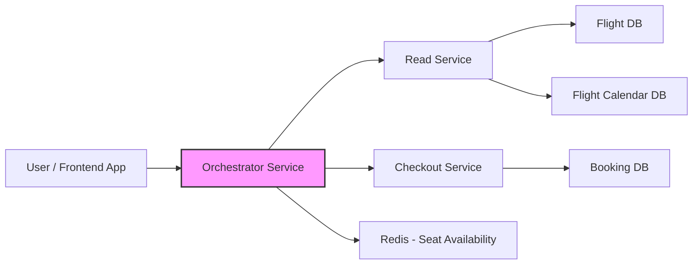
## 4.2 Components & Responsibilities

| Component                | Responsibility                                                                                 |
|--------------------------|------------------------------------------------------------------------------------------------|
| **Read Service**         | Serves flight search requests; owns flight & calendar datasource.                              |
| **Flight DB**            | Stores flight metadata.                                                                        |
| **Flight Calendar DB**   | Stores preprocessed flight calendar data for efficient lookup.                                 |
| **Orchestrator Service** | Coordinates requests between frontend, read service, checkout service, and seat availability.  |
| **Checkout Service**     | Manages booking state machine, tracks booking stages, and stores booking metadata.             |
| **Redis**                | Stores real-time seat availability for each flight and date.                                   |


## 4.3 High-Level Flow / Sequence

**Flow Explanation:**

### Flight Search

1. User searches for flights via the frontend.  
2. Frontend calls Orchestrator → Orchestrator queries Read Service → Read Service fetches flights and calendar → checks seat availability in Redis → returns results to Orchestrator → Orchestrator sends results to frontend.

### Booking Flow

1. User selects a flight and initiates booking.  
2. Frontend calls Orchestrator → Orchestrator creates a checkout entry in Checkout Service → Orchestrator reserves seats in Redis → Checkout Service updates booking status → Orchestrator sends confirmation to frontend.

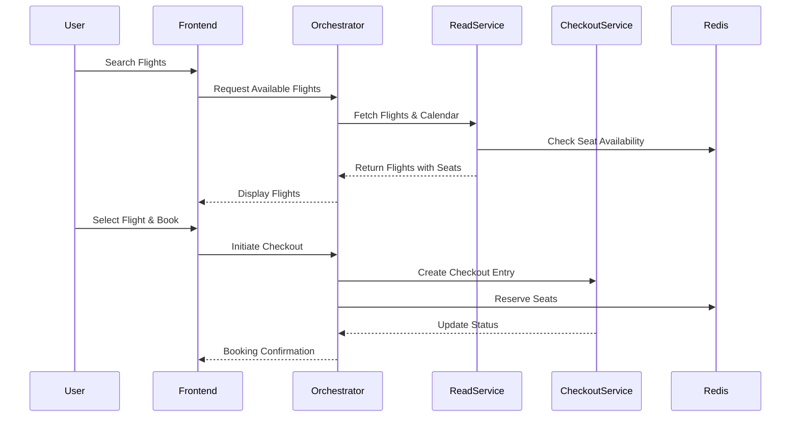

## 4.4 Data Flow / Database Overview

**Flow Explanation:**

- **Flight → FlightCalendar:** Preprocessing job generates a calendar entry for each flight on each applicable date based on its frequency. This allows the read service to serve flight availability quickly without recalculating dates.  
- **Checkout Flow:** Checkout table tracks booking stages for each booking attempt. The state machine ensures transitions like Details → Payment → SUCCESS/FAILURE.

### Flight and Calendar ER Diagram

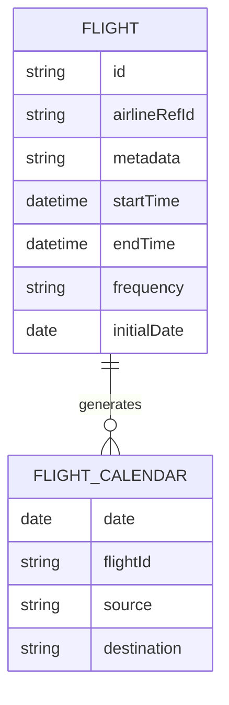

### Checkout ER Diagram
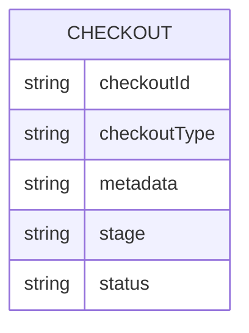

## 4.5 Tech Stack

- **Backend:** Kotlin (Spring Boot / Reactive)  
- **Database:** PostgreSQL for flights and bookings  
- **Cache:** Redis for seat availability  
- **Messaging:** Kafka (optional for async processing)  
- **Frontend:** React / Flutter  
- **Cloud:** AWS / GCP  
- **Other:** Nginx for reverse proxy


## 4.6 High-Level Interfaces

| Source       | Target          | Protocol     | Purpose                        |
|--------------|----------------|-------------|--------------------------------|
| Frontend     | Orchestrator    | REST        | Flight search & booking        |
| Orchestrator | ReadService     | REST/gRPC   | Fetch flights and calendar     |
| Orchestrator | CheckoutService | REST/gRPC   | Create/update booking          |
| Orchestrator | Redis           | TCP         | Update/check seat availability |


## 4.7 Scalability / Security Considerations

- **Horizontal Scaling:** Orchestrator and Read Service can scale horizontally to handle increased load.  
- **Redis Clustering:** For high throughput seat availability queries.  
- **Rate Limiting & API Gateway:** To secure APIs and prevent abuse.  
- **TLS Encryption:** Ensures secure communication between all services.  
- **RBAC (Role-Based Access Control):** Enforces permissions for different user roles.


# 5. Low-Level Design (LLD)

## 5.1 Module / Class Design

**Explanation:**  
Flight and calendar modules store metadata and generate calendar entries.  
Checkout module tracks booking stages using a state machine.

### Flight Module

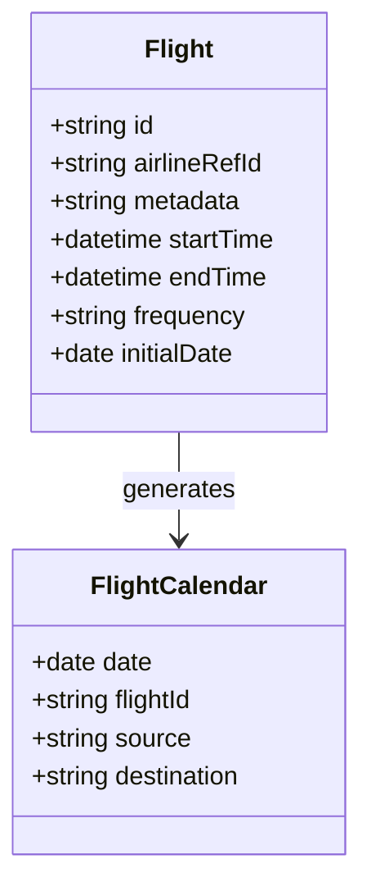

### Checkout Module
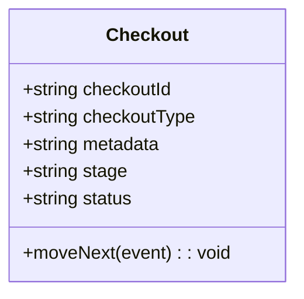

## 5.2 APIs / Interfaces

**Explanation:**  
Endpoints for searching flights, initiating checkout, and updating booking stage.

### Search Flights
GET /flights?source=A&destination=B&date=YYYY-MM-DD

**Response:**
```json
{
  "flights": [
    { 
      "flightId": "string", 
      "airlineId": "string", 
      "startTime": "datetime", 
      "endTime": "datetime", 
      "availableSeats": "integer" 
    }
  ]
}
```

### Initiate Checkout
POST /checkout


**Request:**
```json
{
  "flightId": "string",
  "userId": "string",
  "checkoutType": "string"
}
```

**Response:**
```json
{
  "checkoutId": "string",
  "stage": "string",
  "status": "string"
}
```

###Update Checkout Stage
POST /checkout/{checkoutId}/stage

**Request:**
```json
{
  "event": "string"
}
```

**Response:**
```json
{
  "stage": "string",
  "status": "string"
}

```

## 5.3 Data Structures & DB Design

**Explanation:**  
Tables for flight metadata, calendar entries, bookings, and Redis keys for seat availability.

### Flight Table

| Column        | Type     | Description                  |
|---------------|---------|------------------------------|
| id            | string  | Unique flight identifier     |
| airlineRefId  | string  | Airline reference ID         |
| metadata      | string  | Additional flight metadata   |
| startTime     | datetime| Flight start time            |
| endTime       | datetime| Flight end time              |
| frequency     | string  | Flight frequency             |
| initialDate   | date    | Initial flight date          |

### FlightCalendar Table

| Column    | Type   | Description                 |
|-----------|-------|-----------------------------|
| date      | date  | Flight date                 |
| flightId  | string| Flight ID                   |
| source    | string| Source airport              |
| destination | string | Destination airport       |

### Checkout Table

| Column        | Type   | Description                     |
|---------------|-------|---------------------------------|
| checkoutId    | string| Unique checkout ID              |
| checkoutType  | string| Type of checkout                |
| metadata      | string| Additional metadata             |
| stage         | string| Current stage of the booking    |
| status        | string| Booking status (SUCCESS/FAIL)  |

### Redis Structure

- **Key:** `flight_id_{date}`  
- **Value:**  
```json
{
  "flight_id": "string",
  "airline_id": "string",
  "start_destination": "string",
  "end_destination": "string",
  "availableSeats": "integer"
}
```


## 5.4 Algorithms / Business Logic

### Flight Calendar Preprocessing

**Flow Explanation:**

1. Read all flights from Flight DB.  
2. For each flight, generate calendar entries for the next month based on frequency (DAILY, WEEKLY, ALTERNATE).  
3. Create calendar entries for all valid source → destination segments (handling multiple legs).  
4. Store entries in Flight Calendar DB for fast lookup.

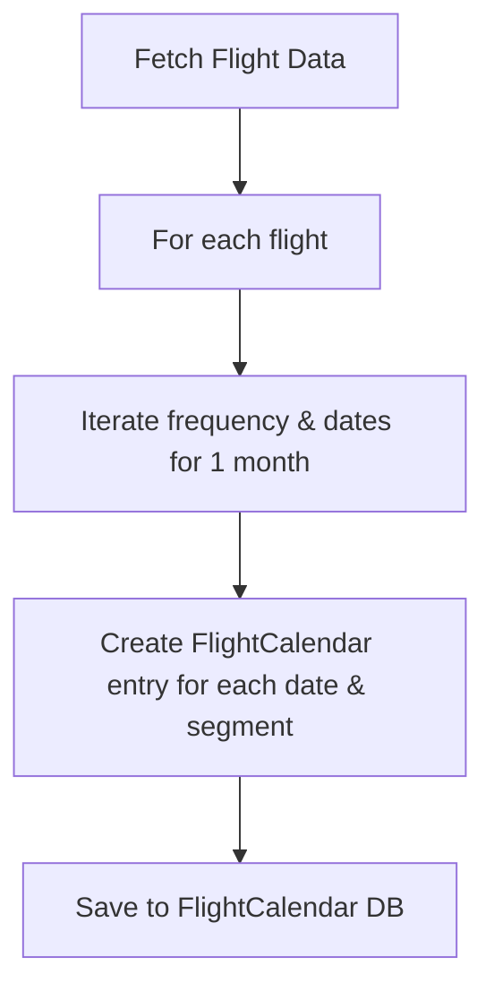

### Seat Availability

**Flow Explanation:**

1. Customer selects flights (direct or connecting).  
2. Orchestrator checks Redis for total available seats per segment.  
3. Deduct seats for the selected segment, ensuring no overbooking for other segments.  
4. Update Redis with new available seats.  
5. Proceed to create checkout entry and complete booking.

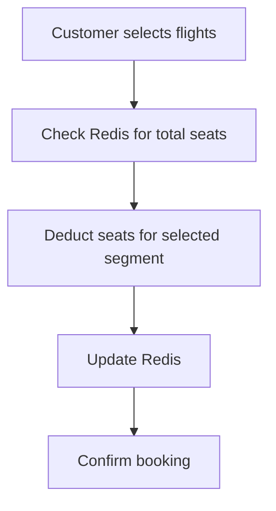

### Detailed Sequence Flow for Booking Connecting Flights

**Flow Explanation:**

- The orchestrator manages both seat allocation and checkout state machine transitions.  
- Redis ensures that seats are deducted atomically to prevent race conditions.  
- Checkout service updates stage after payment success/failure.

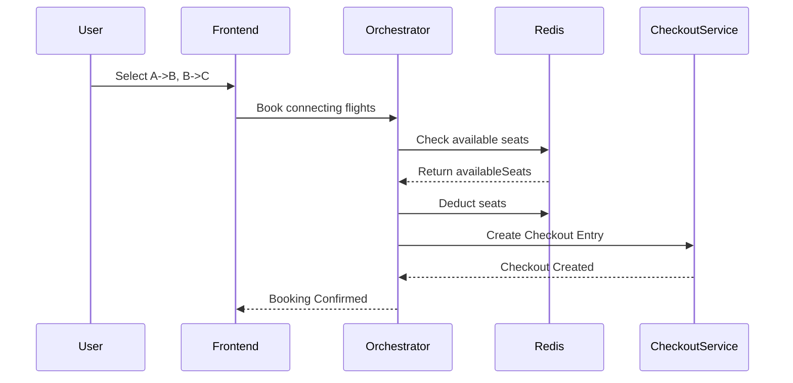

## 5.5 Sequence / Interaction Diagrams 

**Flow Execution Explanation:**  
- **Step 1:** User selects a flight or connecting flights via the frontend.  
- **Step 2:** Frontend calls the orchestrator to initiate the booking.  
- **Step 3:** Orchestrator queries Redis to check the available seats for each segment (direct or connecting).  
- **Step 4:** Orchestrator deducts the booked seats from Redis atomically to prevent overbooking.  
- **Step 5:** Orchestrator calls the Checkout Service to create a booking entry and initialize the state machine.  
- **Step 6:** Checkout Service updates the booking status and stage based on payment success/failure events.  
- **Step 7:** Orchestrator returns booking confirmation or failure to the frontend.  
- **Step 8:** Frontend displays the booking confirmation to the user.

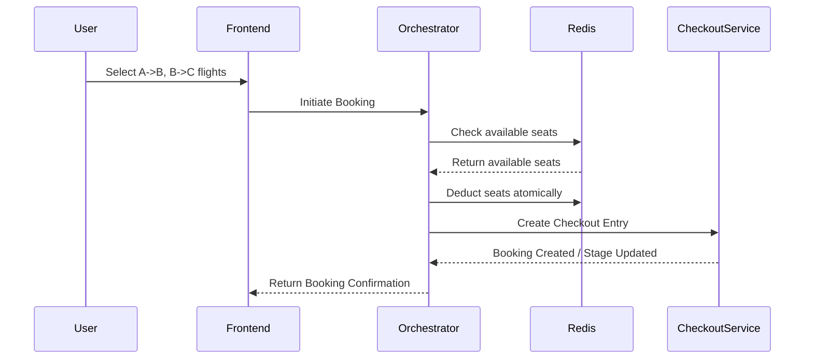


## 5.6 Checkout Service State Machine

The Checkout Service uses a configurable state machine to manage the lifecycle of a booking. This allows each booking type (flights, trains, buses, etc.) to define its own workflow without code changes. The state transitions, events, and terminal stages are fully data-driven using JSON configuration.

**State Machine JSON**

```json
{
  "initialStage": "Details",
  "terminalStages": ["SUCCESS", "FAILURE"],
  "Details": {
    "toPay": {
      "destinationStage": "Payment"
    }
  },
  "Payment": {
    "success": {
      "destinationStage": "SUCCESS"
    },
    "failure": {
      "destinationStage": "FAILURE"
    }
  }
}
```

**Explanation of the State Machine**

***initialStage***
- The stage at which every checkout begins.

```json
"initialStage": "Details"
```

***terminalStages***
- Stages where the workflow ends. No further transitions occur after this state.

```json
"terminalStages": ["SUCCESS", "FAILURE"]
```

***Details Stage***
- Defines the transition from Details → Payment.

```json
"Details": {
  "toPay": {
    "destinationStage": "Payment"
  }
}
```

***Payment Stage***
- Defines transitions based on payment gateway response.

```json
"Payment": {
  "success": {
      "destinationStage": "SUCCESS"
    },
    "failure": {
      "destinationStage": "FAILURE"
    }
}
```

**State Diagram**

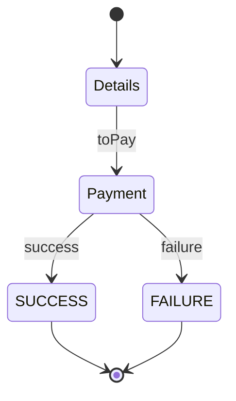

**How Checkout Service Uses the State Machine**

1. User initiates checkout.
2. Checkout Service loads the state machine JSON for the given checkout type.
3. Checkout starts at the `initialStage`.
4. Events such as `toPay`, `success`, or `failure` trigger transitions.
5. The service validates the event and applies the transition.
6. Checkout record is updated with the new stage and status.
7. If a terminal stage is reached, the workflow ends.

**Benefits of This Approach**

- Extensible and supports new booking flows without code changes.
- Clear stage transitions and predictable workflows.
- Enables multi-domain booking support (flights, trains, buses).
- Easier maintenance due to separation of configuration and logic.


## 5.7 Error Handling & Security Implementation

### Error Handling

- **Seat unavailable:** Notify user, suggest alternatives.  
- **Invalid flight:** Return appropriate error response.  
- **Database failure:** Implement retries and alerting for failure notifications.

### Security Implementation

- **Authentication:** OAuth2 for API access.  
- **Transport Security:** TLS encryption for all service communication.  
- **Authorization:** Role-Based Access Control (RBAC) for different user roles.  
- **Data Protection:** Encrypted storage for sensitive information (user data, payment info).


# 6. Assumptions & Constraints

- Flights and calendar are preprocessed daily.  
- Redis is strongly consistent for seat availability.  
- Only daily, weekly, or alternate frequencies are supported for flights.  
- System assumes a single timezone for simplicity.  
- Connecting flight bookings only consider available seats per segment.


# 7. Conclusion / Summary

This system provides a scalable, fault-tolerant, and extensible flight ticketing platform. It supports real-time seat availability, configurable booking workflows, and connecting flights. The modular architecture allows adding new modes of transportation in the future.

