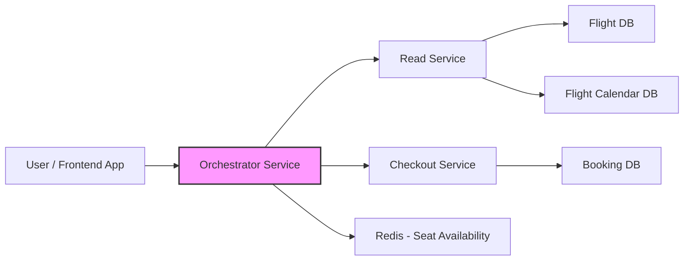
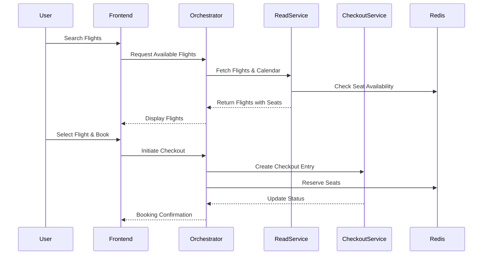

# Flight Ticketing System – Design Document

---

## Table of Contents

* **Overview**
* **Requirements**
    * Functional Requirements
    * Non-Functional Requirements
* **High-Level Design (HLD)**
    * Architecture Diagram
    * Components & Responsibilities
    * High-Level Flow / Sequence
    * Data Flow / Database Overview
    * Tech Stack
    * High-Level Interfaces
    * Scalability / Security Considerations
* **Low-Level Design (LLD)**
    * Module / Class Design
    * APIs / Interfaces
    * Data Structures & DB Design
    * Algorithms / Business Logic
    * Sequence / Interaction Diagrams
    * Error Handling & Security Implementation
* **Assumptions & Constraints**
* **Conclusion / Summary**

# Flight Ticketing System Design Document

## 2. Overview

The Flight Ticketing System allows users to search for available flights, check seat availability, and book tickets.

### Key Features:

* **Supported Flights:** The system accommodates both direct and connecting flights.
* **Flight Data:** Uses a **preprocessed flight calendar** for efficient schedule lookups.
* **Seat Inventory:** Maintains real-time **seat availability** using an **in-memory cache (Redis)** for high performance and strong consistency.
* **Booking Process:** A **configurable state machine** manages the booking workflow, tracking stages and status reliably.

# 3. Requirements

## 3.1 Functional Requirements

- Display available flights to users.
- Allow booking of flights, including connecting flights with layovers.
- Manage seat availability dynamically with Redis for real-time updates.
- Maintain a preprocessed calendar for flights for efficient lookup.
- Support configurable state machines for booking workflows.
- Provide a checkout service that tracks booking stages and status.
- Support multi-modal expansion in the future (railway, buses, etc.).

## 3.2 Non-Functional Requirements

- **Latency:** Search and seat availability queries should respond <200ms.
- **Throughput:** Support 10k+ concurrent bookings.
- **Scalability:** Horizontal scaling for read service, orchestrator, and checkout service.
- **Consistency:** Strong consistency for seat availability to prevent overbooking.
- **Fault Tolerance:** Retry and recovery mechanisms for service failures.
- **Security:** Authentication, authorization, and encrypted storage of sensitive data.

# 4. High-Level Design (HLD)

## 4.1 Architecture Diagram

**Flow Explanation:**

- The User interacts with the Frontend to search for flights or book tickets.
- The Frontend sends requests to the Orchestrator, which is the central coordinator.
- For flight search, the Orchestrator calls the Read Service, which fetches flights and preprocessed calendar data from Flight DB and Flight Calendar DB.
- The Orchestrator also queries Redis to get real-time seat availability for each flight/date.
- For bookings, the Orchestrator communicates with the Checkout Service to create a booking entry and manage its state machine.
- The Orchestrator updates Redis to deduct the reserved seats.
- The booking result is sent back to the Frontend, and the User sees confirmation.

## 4.2 High-Level Flow / Sequence

**Flow Explanation:**

### Flight Search

1. User searches for flights via the frontend.  
2. Frontend calls Orchestrator → Orchestrator queries Read Service → Read Service fetches flights and calendar → checks seat availability in Redis → returns results to Orchestrator → Orchestrator sends results to frontend.

### Booking Flow

1. User selects a flight and initiates booking.  
2. Frontend calls Orchestrator → Orchestrator creates a checkout entry in Checkout Service → Orchestrator reserves seats in Redis → Checkout Service updates booking status → Orchestrator sends confirmation to frontend.

