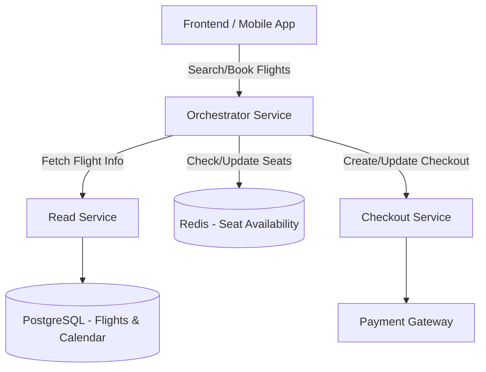
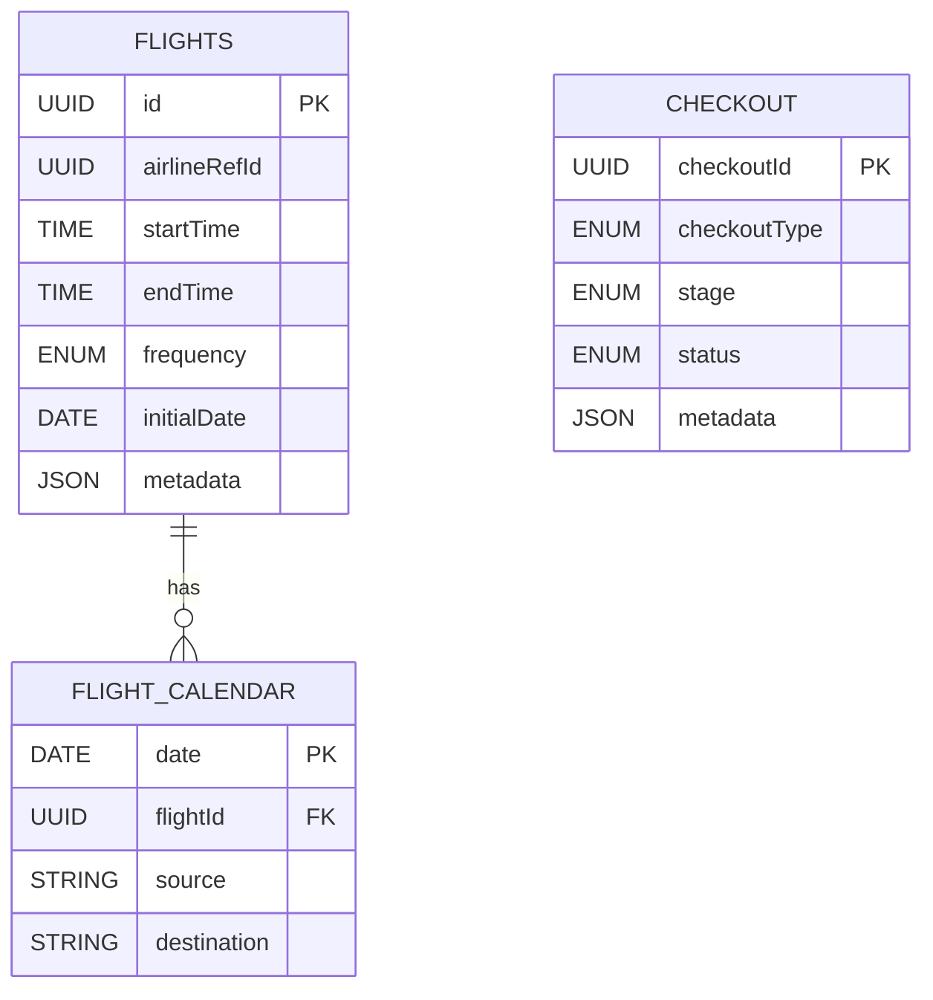
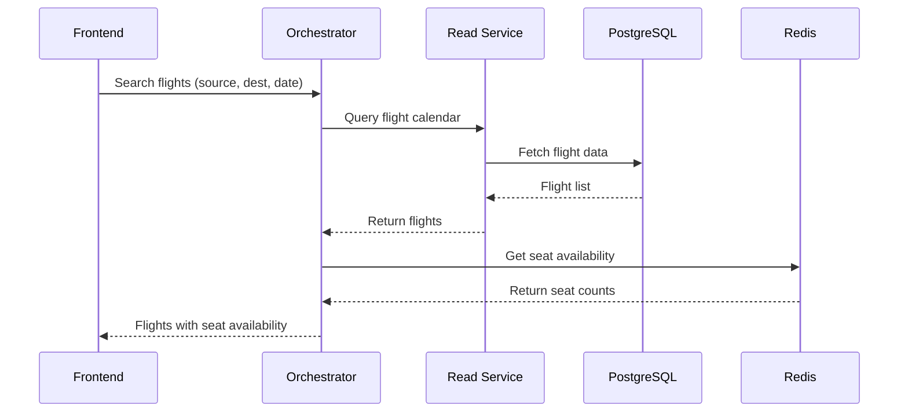
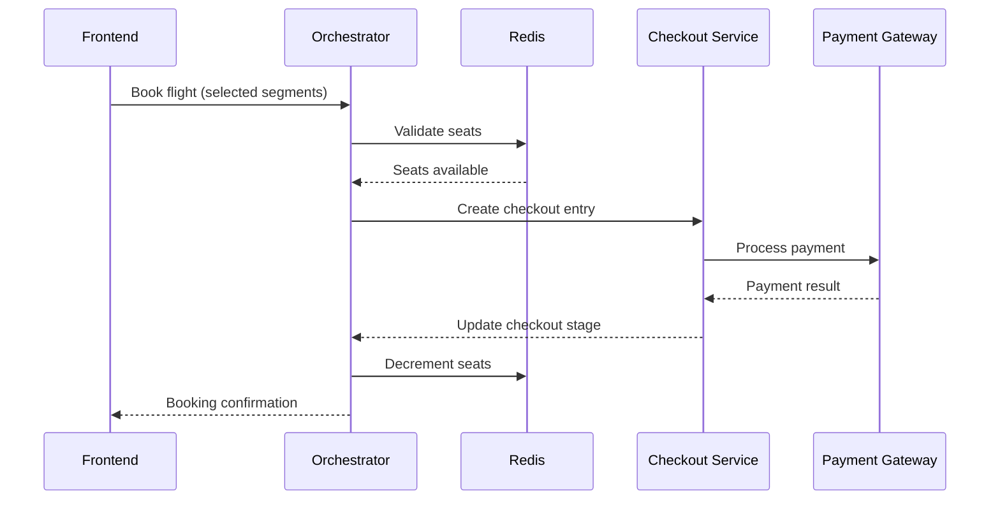

# Flight Ticketing System – Design Document

---

## Table of Contents

1. Summary  
2. Requirements  
   1. Functional Requirements  
   2. Non-Functional Requirements  
3. High-Level Design (HLD)  
   1. Component Listing and Explanation  
   2. Flow and Sequence Diagram with Explanation of the Flow  
   3. Stack Selection  
4. Low-Level Design (LLD)  
   1. Data Models with Classes and Objects  
   2. Schema and Query Pattern with Appropriate Diagrams  
   3. API Designs and Contracts with Explanation  
   4. Pseudocode for Business Logic Explanation and Error Handling  
   5. Sequence Diagrams for the Flows  
5. Glossary / Acronyms  

---

## 1. Summary

The Flight Ticketing System is designed to provide flight search, booking, and checkout functionalities. The system supports multi-leg flights, real-time seat availability using Redis, and configurable state machines to handle different types of bookings. It is highly scalable, extensible, and built using microservices principles.

**Key Features:**
- Flight search with seat availability.
- Checkout with configurable state machines.
- Handling of multi-leg and connecting flights.
- Extensible to other travel types (rail, bus).
- Real-time seat updates and availability tracking.

---

## 2. Requirements

### 2.1 Functional Requirements
1. Search available flights by source, destination, and date.
2. Display seat availability for flights.
3. Support multi-leg and connecting flights.
4. Initiate booking via checkout service.
5. Maintain a configurable state machine for checkout stages.
6. Update seat availability in Redis atomically upon booking.
7. Provide API for frontend and app integration.
8. Preprocess flight calendar for a month.

### 2.2 Non-Functional Requirements
1. **Scalability:** Microservices should scale independently.
2. **Consistency:** Strong consistency for seat availability using Redis.
3. **Extensibility:** Support multiple booking types via state machine.
4. **High Availability:** Services should be deployed in multiple zones.
5. **Low Latency:** Flight search and seat availability response <200ms.
6. **Resilience:** Handle failures gracefully with retry and rollback.

---

## 3. High-Level Design (HLD)

### 3.1 Component Listing and Explanation

| Component           | Responsibility                                                                 |
|--------------------|-------------------------------------------------------------------------------|
| **Read Service**     | Provides flight information and preprocessed flight calendar. Owns flight DB.  |
| **Orchestrator**     | Handles search, checkout orchestration, connecting flights, seat availability. |
| **Checkout Service** | Manages booking state machine, booking creation, and payment stage.           |
| **Redis**            | Stores real-time seat availability and supports atomic updates.               |
| **Database**         | PostgreSQL stores flight, calendar, and checkout data.                        |
| **Frontend / App**   | User interface for searching, selecting, and booking flights.                 |

### 3.2 Flow and Sequence Diagram with Explanation of the Flow

#### HLD Architecture Diagram


**Explanation:**
- Frontend communicates only with the **Orchestrator**.
- Orchestrator coordinates **Read Service**, **Checkout Service**, and **Redis**.
- Flight metadata stored in **PostgreSQL**, seat availability in **Redis**.
- Payment handled through external **Payment Gateway**.

### 3.3 Stack Selection

| Layer                 | Technology                                  |
|----------------------|--------------------------------------------|
| Backend               | Kotlin Coroutine, Spring Boot               |
| Database              | PostgreSQL                                  |
| Cache                 | Redis                                        |
| Messaging (optional)  | Kafka                                       |
| API Gateway           | Nginx / Spring Cloud Gateway               |
| Frontend              | React / Angular                             |

**Reasoning:**  
- Kotlin Coroutines for asynchronous, non-blocking IO.  
- Postgres for transactional data and flight metadata.  
- Redis for fast seat availability updates and atomic decrements.

---

## 4. Low-Level Design (LLD)

### 4.1 Data Models (Classes / Objects)

```kotlin
data class Flight(
    val id: String,
    val airlineRefId: String,
    val metadata: Map<String, String>,
    val startTime: LocalTime,
    val endTime: LocalTime,
    val frequency: Frequency,
    val initialDate: LocalDate
)

data class FlightCalendar(
    val date: LocalDate,
    val flightId: String,
    val source: String,
    val destination: String
)

data class Checkout(
    val checkoutId: String,
    val checkoutType: CheckoutType,
    val metadata: Map<String, Any>,
    val stage: CheckoutStage,
    val status: CheckoutStatus
)
```

### 4.2 Schema and Query Pattern with Diagrams

#### ER Diagram


### 4.3 API Designs and Contracts

#### Read Service
- `GET /flights?source=A&destination=B&date=YYYY-MM-DD` → returns flight list with seat availability.  
- `GET /flight/{flightId}/calendar` → returns flight calendar for next 30 days.  

#### Checkout Service
- `POST /checkout` → creates checkout entry.  
- `PATCH /checkout/{checkoutId}/stage` → moves booking to next stage.  
- `GET /checkout/{checkoutId}` → fetch checkout status.  

#### Orchestrator Service
- `POST /book` → initiates booking, handles seat availability, and updates checkout stages.  
- `GET /search-flights` → orchestrates Read Service + Redis to show available flights.

### 4.4 Pseudocode for Business Logic and Error Handling

```kotlin
suspend fun bookFlight(customerId: String, flightSegments: List<FlightSegment>) {
    transaction {
        flightSegments.forEach { segment ->
            val seatsAvailable = redis.getSeats(segment.flightId, segment.date)
            if (seatsAvailable < segment.passengerCount) {
                throw SeatsUnavailableException("Not enough seats for flight ${segment.flightId}")
            }
        }

        val checkoutId = checkoutService.createCheckout(customerId, flightSegments)

        val paymentSuccess = paymentGateway.processPayment(checkoutId)
        if (!paymentSuccess) {
            checkoutService.updateStage(checkoutId, "FAILURE")
            rollbackTransaction()
            return
        }

        flightSegments.forEach { segment ->
            redis.decrementSeats(segment.flightId, segment.date, segment.passengerCount)
        }

        checkoutService.updateStage(checkoutId, "SUCCESS")
    }
}
```

### 4.5 Sequence Diagrams

#### Flight Search Flow


#### Flight Booking Flow


---

## 5. Glossary / Acronyms

| Term / Acronym | Meaning |
|----------------|---------|
| HLD            | High-Level Design |
| LLD            | Low-Level Design |
| Redis          | In-memory cache for seat availability |
| Checkout       | Booking process object |
| Orchestrator   | Service coordinating Read and Checkout services |
| Multi-leg      | Flights with connecting flights / layovers |
| Coroutine      | Kotlin asynchronous task handling |

